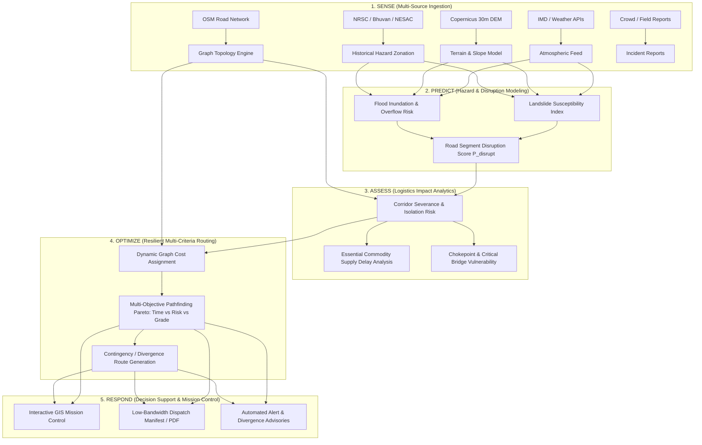

# NER-GRID Prototype Specification
**Predictive Logistics & Accessibility Intelligence Network for North Eastern India**  
**Problem Statement:** SIH26002 | Smart India Hackathon 2026

---

## 1. Executive Summary & Regional Context

The North Eastern Region (NER) of India—comprising Arunachal Pradesh, Assam, Manipur, Meghalaya, Mizoram, Nagaland, Sikkim, and Tripura—faces extreme logistics and transport vulnerabilities:
- **Topographical Bottlenecks**: Mountainous terrain, active tectonic fault lines (Seismic Zone V), and steep slope gradients.
- **Hydrological Extremes**: Heavy monsoonal precipitation, cloudbursts, severe flash flooding, and bank erosion in the Brahmaputra and Barak river basins.
- **Critical Lifeline Fragility**: National highways like NH-10 (Siliguri–Gangtok), NH-29 (Dimapur–Kohima), and NH-06 (Shillong–Silchar) suffer recurrent landslide blockages, washing out bridges and stranding vital freight for days.
- **Geopolitical & Strategic Significance**: Reliance on the narrow Siliguri Corridor ("Chicken's Neck") makes multi-modal supply chains (civilian food security, pharmaceuticals, defense logistics, disaster relief) hyper-sensitive to localized disruptions.

**NER-GRID** is an AI-powered, real-data-driven predictive logistics intelligence platform engineered to sense multi-hazard threats, forecast disruption probabilities on transportation networks, assess supply chain impacts, and compute risk-optimal routing solutions.

---

## 2. Core Architectural Paradigm: Sense → Predict → Assess → Optimize → Respond

---

## 3. Detailed Stage Breakdown

### 3.1. SENSE: Data Ingestion & Harmonization
- **Road Network**: Graph representation derived from OpenStreetMap (OSM) highway network covering primary, trunk, secondary, and tertiary roads in the NER, enriched with surface type, lane counts, and bridge locations.
- **Elevation & Terrain**: 30m Digital Elevation Model (Copernicus GLO-30 / SRTM 30m) processing for slope angle, aspect, curvature, and elevation profiles.
- **Meteorological Observations & Forecasts**: Real-time precipitation, 24h cumulative rainfall, and 48h forecasts from IMD stations and calibrated meteorological models.
- **Earth Observation & Geological Hazard Baselines**: Landslide hazard zonation data from the NRSC Landslide Atlas of India, and NESAC flood hazard zonation layers.
- **Field & Ground Truth Reports**: Structured schema for ground-reported roadblocks, mudslides, bridge submergence, or military/BRO (Border Roads Organisation) advisories.

### 3.2. PREDICT: Disruption Modeling
- **Landslide Susceptibility Index (LSI)**: Combines static terrain factors (slope, aspect, elevation) with dynamic triggers (antecedent precipitation index, current rainfall intensity) using empirical thresholds (e.g., Caine-style rainfall-intensity-duration curves adapted for Himalayan/Indo-Burman geology).
- **Flood Inundation Risk**: Estimates localized road submergence probability based on topographic wetness index (TWI), proximity to river centerlines (Brahmaputra/Barak tributaries), and forecasted precipitation.
- **Segment Disruption Probability ($P_{disrupt}$)**:
  $$P_{disrupt}(e) = 1 - (1 - P_{landslide}(e)) \cdot (1 - P_{flood}(e)) \cdot (1 - P_{incident}(e))$$
  Where each road edge $e$ is scored dynamically from 0.0 (fully clear) to 1.0 (impassable).

### 3.3. ASSESS: Logistics & Accessibility Impact
- **Network Resilience Metrics**: Identification of critical cut-edges (bridges or passes where failure causes graph disconnection or isolates entire administrative districts).
- **Vulnerability Indices**: Assessment of vulnerable nodes (district headquarters, hospitals, emergency staging warehouses) that risk being cut off from Siliguri/Guwahati hubs.
- **Supply-Chain Buffer Degradation**: Estimation of delay for perishable commodities, medical oxygen, and emergency fuel supplies under forecasted disruptions.

### 3.4. OPTIMIZE: Multi-Criteria Resilient Routing
- **Objective Function**: Computes optimal paths balancing:
  $$\min \sum_{e \in \text{Path}} \left[ w_t \cdot \text{Time}(e) + w_r \cdot \text{Risk}(e) + w_g \cdot \text{SlopePenalty}(e) + w_s \cdot \text{SurfacePenalty}(e) \right]$$
- **Mission Profiles**:
  1. *Speed Priority*: Urgent medical evacuation / high-priority transit (accepts higher risk if roads are still open).
  2. *Safety Priority*: Heavy freight / hazardous cargo / fuel tankers (avoids steep mountain passes and moderate landslide zones).
  3. *All-Weather Robustness*: Prefers paved NH/SH corridors over vulnerable unpaved rural tracks regardless of extra distance.
- **Divergence & Chokepoint Bypasses**: Computes primary route alongside pre-planned diversion staging points before high-hazard segments.

### 3.5. RESPOND: Decision-Support Outputs
- **Tactical Map Visualization**: Vector tile / Deck.gl visualization of the road network colored by real-time risk level, active alerts, and weather radar overlays.
- **Driver / Fleet Dispatch Manifest**: Downloadable lightweight route card with step-by-step navigation, elevation profile, critical hazard alerts, and emergency contacts along the route.
- **Offline / Low-Bandwidth Mode**: Ability to export cached route instructions when traversing dead zones in high-altitude areas.

---

## 4. Data Provenance Standard

To maintain absolute integrity, every piece of data ingested, displayed, or analyzed is categorized under the **NER-GRID Provenance Classification**:

| Category | Definition | Visual / API Tag | Examples |
|---|---|---|---|
| **Observed** | Directly recorded by calibrated physical instruments, satellites, or AWS stations | `DataOrigin.OBSERVED` | IMD rain gauges, Sentinel/Landsat imagery, river gauge stages |
| **Reported** | Submitted by human observers, official agencies, or field personnel | `DataOrigin.REPORTED` | BRO road clearance bulletins, police alerts, NDMA advisories |
| **Predicted** | Computed by statistical models, ML pipelines, or physics-based simulations | `DataOrigin.PREDICTED` | 24h rainfall forecasts, landslide probability, travel time estimates |
| **Simulated** | Synthetic data generated for algorithm benchmarking, edge-case testing, or missing sensors | `DataOrigin.SIMULATED` | Synthetic road blockage injection, stress-test vehicle fleets |

---

## 5. Prototype Scope & Phasing

### Phase 1: SIH Core Prototype (Current Goal)
1. **Target Geography**: Key strategic corridor in the North East:
   - **Corridor 1 (Mountain Lifeline)**: Siliguri $\leftrightarrow$ Gangtok (NH-10) — high landslide risk.
   - **Corridor 2 (Inter-State Transit)**: Guwahati $\leftrightarrow$ Shillong $\leftrightarrow$ Silchar (NH-06) — high rain/flood & landslide corridor.
2. **Real Data Ingestion**:
   - Copernicus DEM 30m / SRTM elevation extract for the corridor.
   - OpenStreetMap road network extracted and parsed into a network graph.
   - Live weather integration via verified IMD / calibrated meteorological feeds.
   - NRSC Landslide Atlas district hazard ratings as baseline static susceptibility.
3. **Core Backend Engine**:
   - FastAPI modular architecture.
   - Risk scoring algorithm assigning dynamic weights to road edges.
   - Multi-criteria route optimizer generating optimal vs contingency routes.
4. **Interactive Mission Dashboard**:
   - Modern GIS view with dynamic layer toggling (road network, hazard zones, elevation contours, weather).
   - Mission dispatch route planner with vehicle profile selection.
   - Transparent provenance inspection on every data layer.

### Phase 2: Post-Hackathon / Full Scale
- Live telemetry from IoT-equipped vehicle fleets.
- Direct telemetry integration with CWC river sensors and NESAC FLEWS APIs upon government partnership.
- Autonomous satellite SAR change detection for real-time flood mapping.
